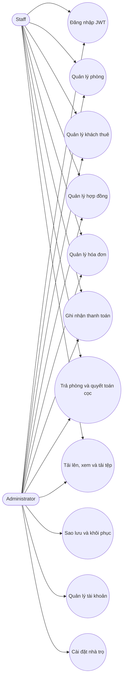

# Use Case — DA05 Quản lý phòng trọ

```mermaid
flowchart LR
  Administrator([Administrator])
  Staff([Staff])
  Login((Đăng nhập JWT))
  ManageRooms((Quản lý phòng))
  ManageTenants((Quản lý khách thuê))
  ManageContracts((Quản lý hợp đồng))
  ManageInvoices((Quản lý hóa đơn))
  Payments((Ghi nhận thanh toán))
  Checkout((Trả phòng và quyết toán cọc))
  Files((Tải lên, xem và tải tệp))
  Backup((Sao lưu và khôi phục))
  Users((Quản lý tài khoản))
  Settings((Cài đặt nhà trọ))
  Administrator --> Login
  Staff --> Login
  Administrator --> ManageRooms
  Administrator --> ManageTenants
  Administrator --> ManageContracts
  Administrator --> ManageInvoices
  Administrator --> Payments
  Administrator --> Checkout
  Administrator --> Files
  Administrator --> Backup
  Administrator --> Users
  Administrator --> Settings
  Staff --> ManageRooms
  Staff --> ManageTenants
  Staff --> ManageContracts
  Staff --> ManageInvoices
  Staff --> Payments
  Staff --> Checkout
  Staff --> Files
```

API kiểm tra quyền tại backend. Staff không được xóa hồ sơ hoặc sử dụng chức năng quản trị.
